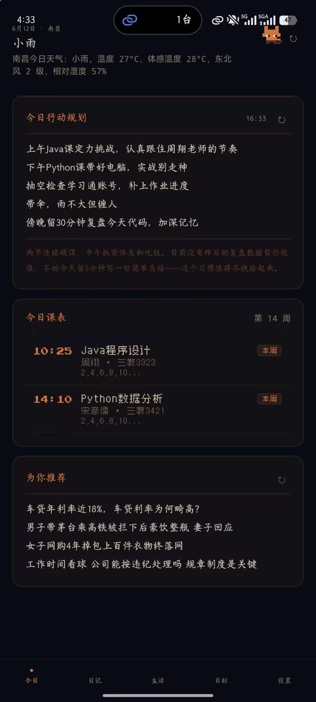
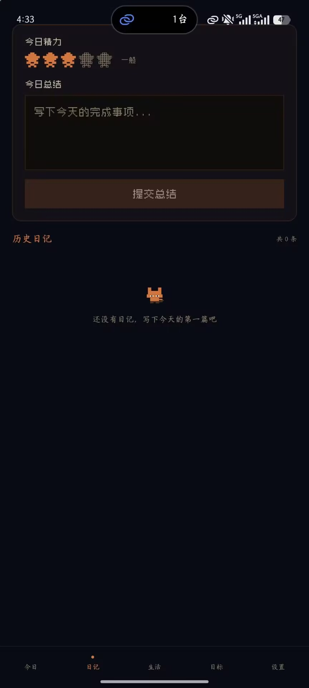
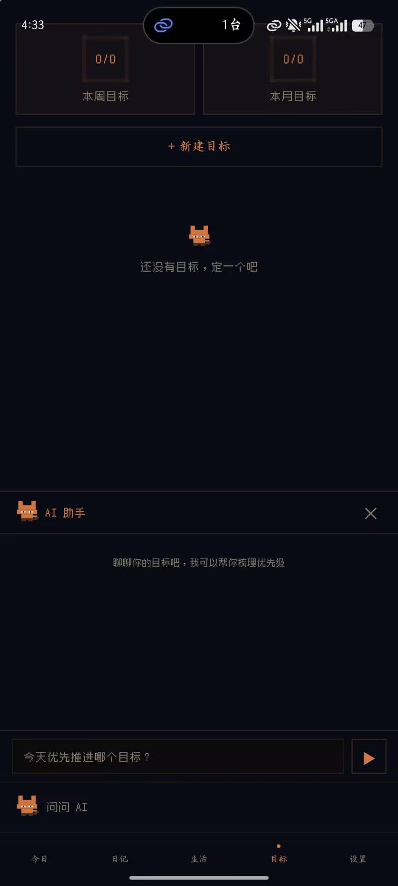
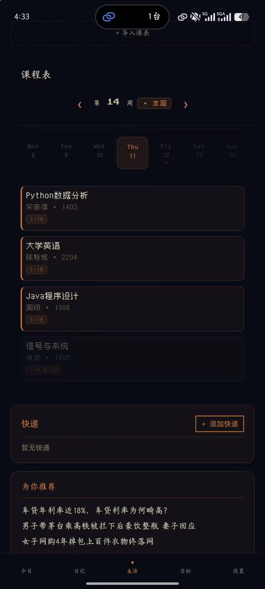

# 🌤️ DayAgent

> 早上醒来，一键了解今天该怎么过。

DayAgent 是一个**个人每日智能规划助手**。每天早上自动融合天气、课表、作业、快递、新闻、昨日总结等多源数据，通过 AI 生成属于你的当日行动建议。晚上记录总结，形成每日闭环。

不是简单的闹钟提醒，而是**结合你的历史行为规律，做个性化智能决策**。

---

<p align="center">
  
  
  
  
  
  
</p>

---

## ✨ 能做什么

- 🌦️ **早晨一键规划** — 综合天气、课表、作业、快递、新闻，AI 生成今日重点
- 📚 **学习通 + 教务抓取** — 自动拉取作业截止日期和课表，不用手动查
- 📦 **快递追踪** — 支持 16 家快递公司，签收自动标记
- 📰 **个性化新闻** — LLM 根据你的目标筛选 3～5 条你真正关心的新闻
- 🧠 **长期记忆** — 分析精力趋势、计划完成度、目标进度
- 💬 **AI 私助对话** — 知道你所有上下文（课表、作业、目标）的专属助手
- 🎨 **像素风桌面端** — Liminal pixel art 风格，动态天气背景 + 雨雪粒子 + 像素猫

---

## 🖼️ 预览

<p align="center">
  
  
  
  
</p>

---

## 🏗️ 架构

```
┌──────────────────────────────────────────┐
│         Vue 3 + Electron 桌面端           │
│     像素风 UI · 动态天气背景 · 粒子系统    │
└──────────────┬───────────────────────────┘
               │ HTTP (JWT Bearer)
┌──────────────▼───────────────────────────┐
│        Java Spring Boot（业务层）          │
│     用户鉴权 · 数据持久化 · 生活模块代理    │
└──────────────┬───────────────────────────┘
               │ HTTP 内部调用
┌──────────────▼───────────────────────────┐
│        Python FastAPI（Agent 层）          │
│  数据抓取 · LLM 规划 · 新闻筛选 · 记忆分析  │
└──────────────┬───────────────────────────┘
               │
┌──────────────▼───────────────────────────┐
│           MySQL · InfluxDB · MQTT         │
│          持久化 · 时序数据 · IoT 消息       │
└──────────────────────────────────────────┘
```

### 数据流

```
多源数据                           AI 输出
─────────                        ─────────
和风天气 API ─┐
学习通抓取 ───┤
教务课表 ─────┼──→ 融合 Prompt ──→ DeepSeek LLM ──→ 今日规划
快递 100 ────┤                                      ├─ 4~5 条重点
个性化新闻 ──┤                                      ├─ 天气提醒
昨日总结 ────┘                                      └─ 快递通知
```

---

## 🚀 快速开始

### 环境要求

- Java 17+ & Maven 3.8+
- Python 3.11+
- Node.js 18+
- MySQL 8.0

### 1. 克隆项目

```bash
git clone https://github.com/00103-a/dayagent-backend.git
cd dayagent-backend
```

### 2. 配置环境变量

在 `agent_service/` 下创建 `.env` 文件：

```env
# 必填
LLM_API_KEY=你的DeepSeek密钥
LLM_BASE_URL=https://api.deepseek.com
LLM_MODEL=deepseek-chat
QWEATHER_KEY=你的和风天气key
JWC_USERNAME=教务系统账号
JWC_PASSWORD=教务系统密码
CHAOXING_USERNAME=学习通账号
CHAOXING_PASSWORD=学习通密码
SEMESTER_START=2026-03-09

# 可选
KUAIDI100_CUSTOMER=快递100客户号
KUAIDI100_KEY=快递100密钥
NEWS_API_KEY=新闻API密钥
```

### 3. 初始化数据库

```sql
CREATE DATABASE IF NOT EXISTS dayagent DEFAULT CHARSET utf8mb4;
```

然后执行 [建表 SQL](#数据库表结构)（见下方）。

### 4. 启动服务

按顺序启动：

```bash
# ① Python Agent 服务 (端口 8000)
cd agent_service
pip install -r requirements.txt
uvicorn agent_service.main:app --port 8000

# ② Java 业务服务 (端口 8080)
cd business-service
./mvnw spring-boot:run

# ③ 前端开发服务器 (端口 3000)
cd frontend
npm install
npm run dev

# ④ Electron 桌面端（可选）
npm run electron:dev
```

### 5. 打开浏览器

访问 `http://localhost:3000`，注册账号即可体验。

### Docker 部署（可选）

```bash
docker compose up -d
```

---

## 📡 核心接口

### 前端 → Java（`/api/*`，JWT 鉴权）

| 方法 | 接口 | 说明 |
|------|------|------|
| POST | `/api/user/register` | 注册 |
| POST | `/api/user/login` | 登录 → 返回 token |
| GET | `/api/plan?location=南昌` | 获取今日规划 |
| GET | `/api/weather?location=北京` | 天气（含天气类型） |
| GET | `/api/news` | 个性化新闻 |
| GET | `/api/courses?week=` | 课程查询 |
| GET | `/api/chaoxing/tasks` | 学习通作业 |
| POST | `/api/summary` | 提交每日总结 |
| POST | `/api/goal` | 创建目标 |
| GET | `/api/parcel` | 快递列表 |
| POST | `/api/chat` | AI 对话 |

---

## 🧩 技术栈

| 层 | 技术 |
|---|---|
| 桌面端 | Vue 3 + Vite + Electron |
| 业务后端 | Java 17 · Spring Boot 3.4 · MyBatis Plus 3.5 |
| AI 层 | Python 3.11 · FastAPI · Playwright |
| 大模型 | DeepSeek（OpenAI 兼容接口） |
| 数据库 | MySQL 8 |
| IoT（实验中） | MQTT · InfluxDB · ESP32 |

---

## 📂 项目结构

```
dayagent/
├── frontend/              # Vue 3 + Electron 桌面端
│   ├── src/views/         # 页面（今日/总结/目标/生活/对话/设置）
│   ├── src/components/    # 像素风组件库
│   │   └── shared/        # SceneBackground（天气粒子 + 像素猫）
│   └── electron/          # Electron 主进程
├── business-service/      # Java Spring Boot 业务层
│   └── src/main/java/com/dayagent/
│       ├── controller/    # REST 接口
│       ├── service/       # 业务 + Agent 调用
│       └── entity/        # 数据模型
├── agent_service/         # Python FastAPI Agent 层
│   ├── routers/           # 路由（plan/weather/news/chat...）
│   ├── agents/            # 智能体（planner/memory）
│   ├── tools/             # 工具（weather/chaoxing/jwc/news/parcel）
│   └── prompts/           # LLM 提示词模板
├── docker-compose.yml     # Docker 编排
├── nginx/                 # 反向代理配置
└── docs/                  # 开发文档
```

---

## 🎨 UI 风格

**Liminal Pixel Art** — 参考 Undertale / 独立游戏美术。

- 深色暗夜基调，橙色 `#e07030` 为唯一暖色点缀
- 动态场景背景：天气 + 时段双维度驱动
- Canvas 粒子系统：雨丝、雪花、窗玻璃水珠
- 窗台上的像素猫：16×16，会眨眼、有呼吸动画
- CRT 扫描线 + Vignette 晕影遮罩

---

## 📋 数据库表结构

<details>
<summary>点击展开 SQL</summary>

```sql
CREATE TABLE user (
    id BIGINT PRIMARY KEY AUTO_INCREMENT,
    username VARCHAR(50) NOT NULL UNIQUE,
    password VARCHAR(255) NOT NULL COMMENT 'BCrypt加密',
    created_at DATETIME DEFAULT CURRENT_TIMESTAMP
);

CREATE TABLE daily_plan (
    id BIGINT PRIMARY KEY AUTO_INCREMENT,
    user_id BIGINT NOT NULL,
    plan_date DATE NOT NULL,
    content TEXT NOT NULL,
    raw_data JSON COMMENT '多源数据快照',
    created_at DATETIME DEFAULT CURRENT_TIMESTAMP,
    INDEX idx_user_plan_date (user_id, plan_date)
);

CREATE TABLE daily_summary (
    id BIGINT PRIMARY KEY AUTO_INCREMENT,
    user_id BIGINT NOT NULL,
    summary_date DATE NOT NULL,
    content TEXT NOT NULL,
    mood_score TINYINT COMMENT '精力评分 1-5',
    created_at DATETIME DEFAULT CURRENT_TIMESTAMP,
    INDEX idx_user_date (user_id, summary_date)
);

CREATE TABLE goal (
    id BIGINT PRIMARY KEY AUTO_INCREMENT,
    user_id BIGINT NOT NULL,
    type ENUM('weekly', 'monthly') NOT NULL,
    content VARCHAR(500) NOT NULL,
    start_date DATE,
    end_date DATE,
    status ENUM('active', 'done') DEFAULT 'active',
    INDEX idx_user_status (user_id, status)
);

CREATE TABLE parcel (
    id BIGINT PRIMARY KEY AUTO_INCREMENT,
    user_id BIGINT NOT NULL,
    tracking_no VARCHAR(100) NOT NULL,
    carrier VARCHAR(50),
    remark VARCHAR(100),
    status VARCHAR(200),
    track_details TEXT COMMENT '完整物流轨迹JSON',
    is_delivered BOOLEAN DEFAULT FALSE,
    created_at DATETIME DEFAULT CURRENT_TIMESTAMP,
    INDEX idx_user_delivered (user_id, is_delivered)
);
```

</details>

---

## 🗺️ Roadmap

- [x] 多源数据融合 + LLM 规划生成
- [x] 学习通 & 教务系统抓取
- [x] Electron 像素风桌面端
- [x] 天气驱动的动态场景（雨/雪/云/晴）
- [x] 快递追踪（16 家快递公司）
- [x] 个性化新闻筛选
- [x] 长期记忆分析 MVP
- [ ] AI 聊天模块（上下文感知）
- [ ] 网易云音乐集成
- [ ] 企业微信推送落地
- [ ] 周报 / 月报自动生成
- [ ] Redis 缓存 + 向量数据库

---

## ⚠️ 注意事项

- 学习通/教务抓取为模拟登录，账号密码本地存储，请勿上传 `.env`
- NeteaseCloudMusicApi 为逆向接口，仅供个人使用
- 本项目为个人学习作品，欢迎参考交流

---

## 📄 License

MIT License
